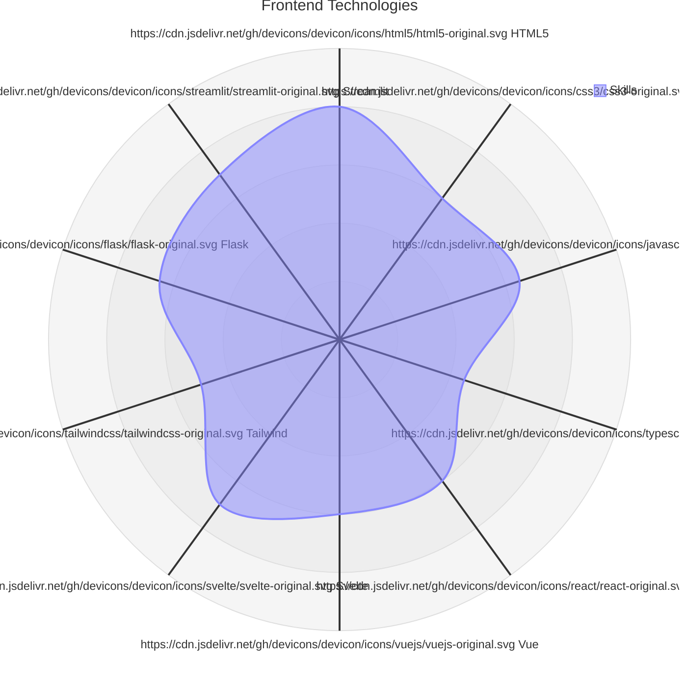
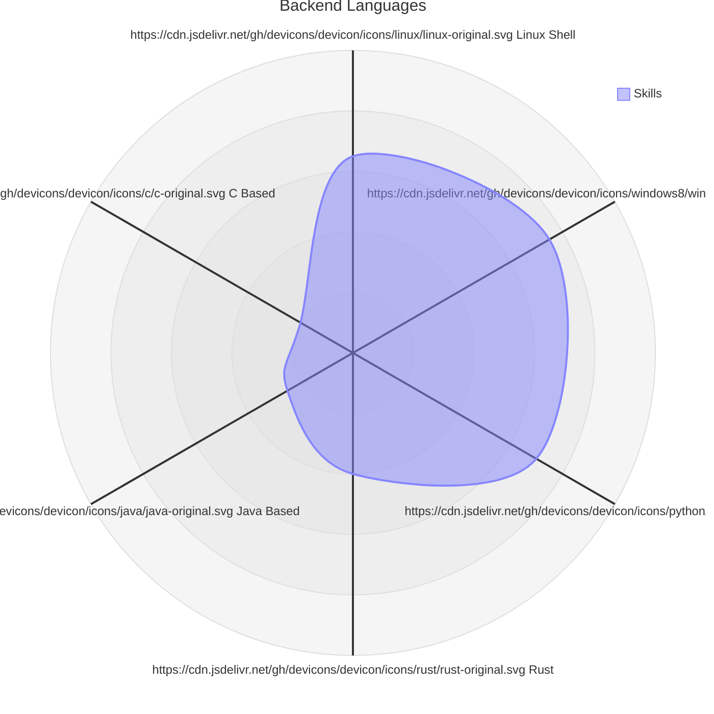
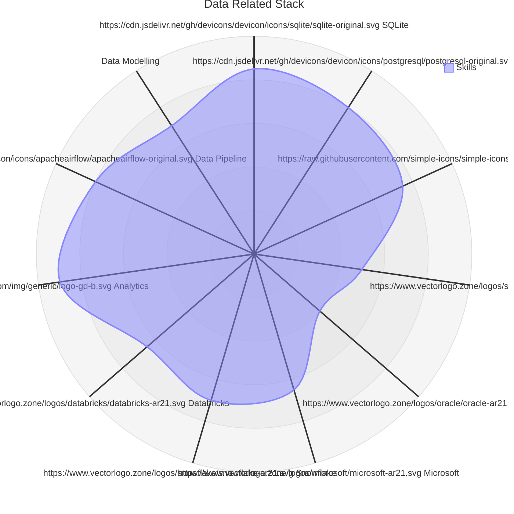
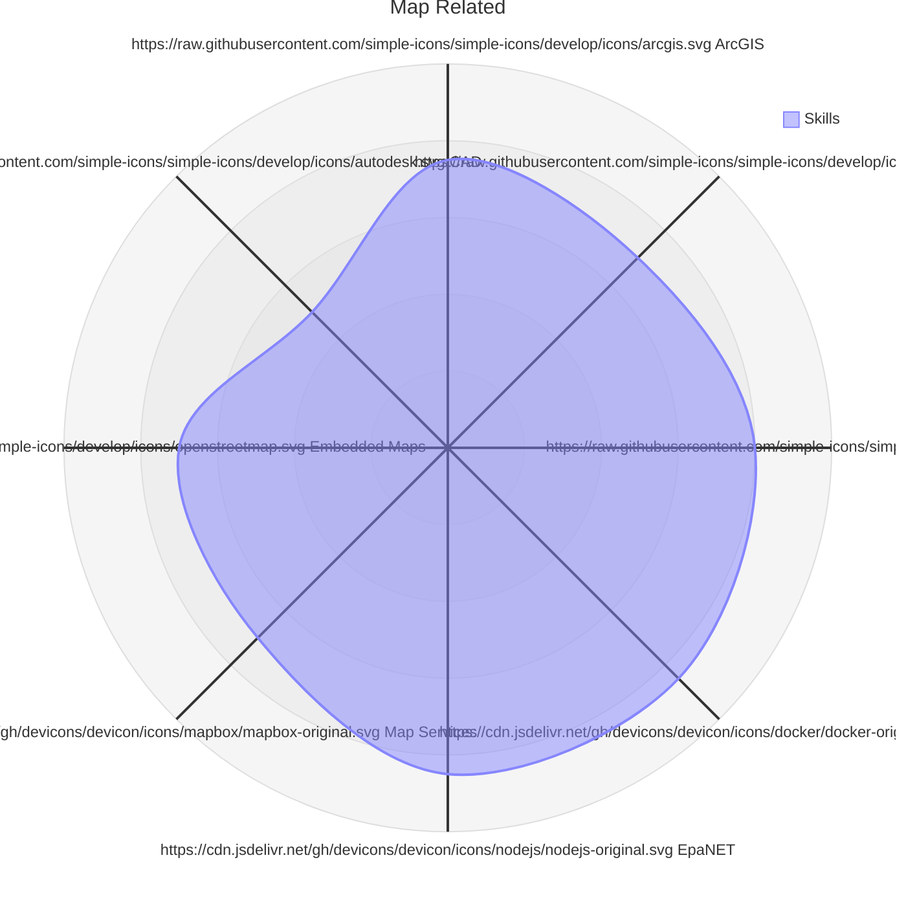
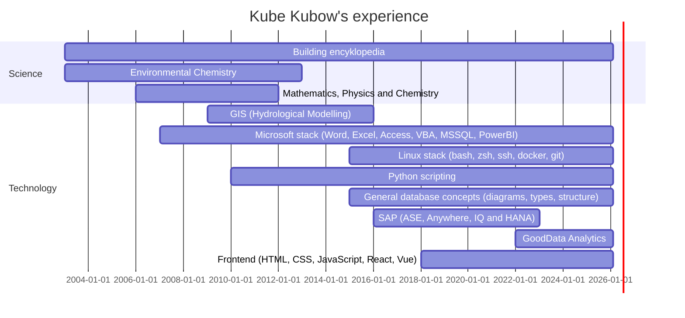

	:space_invader: :curly_loop: :wavy_dash: :curly_loop: :space_invader:

	:muscle: :small_blue_diamond: :blue_heart: :small_blue_diamond: :hand:

<h2 align="center">
	:gemini:
</h2>

I am currently spending the majority of my time around [GoodData's integrations](https://github.com/kubow?tab=repositories&q=gooddata&type=&language=&sort=) with various types of systems.

I have recently started collaboration on an [Astrology application](https://github.com/kefer-astrology).

My other big project is a "[Star Encyclopedia](https://github.com/kubow/h808e)" (Summarizing all things around us 🌅) with several sub-projects:

- [ARMs: various machines description](https://github.com/kubow/arms)
- [Data storing techniques](https://github.com/kubow/datastore)
- [Mapping / GIS](https://github.com/kubow/map-model)
- [Productivity](https://github.com/kubow/Productivity)
- [Programming languages](https://github.com/kubow/prg-concepts)

I am also creating small applications with a very specific usage:

- [Python database logs reader](https://github.com/kubow/Sybase_Collector) (mostly SAP, Microsoft, Oracle...)
- [Python EpaNET simple GUI](https://github.com/kubow/EpaNET-TKinter-GUI) (I plan to interconnect with Mike0/dfs)
- [Python contacts editor](https://github.com/kubow/vcf_editor) (those ancient VCards)
- [Python planet/moon compute](https://github.com/kubow/PlanetarySystemObserver) (using NASA JPL ephemerides)
- [Python universal browser/editor](https://github.com/kubow/JSONXML_editor) (currently JSON, XML and CSV files)

## My presence is being felt here

	

	

	

	

	

	

	

	

## Visual representation of my technology skill set

### Frontend Technologies

### Backend Languages

**Note:** Linux Shell: sh, zsh, bash and various tools (like sed, grep, ...)

**Note:** Windows Shell: bat, powershell, vbscrips

### Data Related Stack

**Note:** SAP: ASE, Anywhere, IQ and HANA

**Note:** Microsoft: MSSQL, Access, VBA, PowerBI

**Note:** Analytics: GoodData, PowerBI

**Note:** Data Pipeline: airflow, n8n, dbt, dlt, etc.

**Note:** Data Modelling: erwin, powerdesigner

### Map Related

**Note:** Map Services: mapbox, maplibre, osm

**Note:** Embedded Maps: OpenLayers, leaflet, D3

## Record of technologies achieved

<!---
kubow/kubow is a "special" repository because its `README.md` (this file) appears on your GitHub profile.
You can click the Preview link to take a look at your changes.
Generated by update-bio workflow.
--->