	:space_invader: :curly_loop: :wavy_dash: :curly_loop: :space_invader:

	:muscle: :small_blue_diamond: :blue_heart: :small_blue_diamond: :hand:

<h2 align="center">
	:gemini:
</h2>

I am currently spending the majority of my time around [GoodData's integrations](https://github.com/kubow?tab=repositories&q=gooddata&type=&language=&sort=) with various types of systems.

My other big project is a "[Star Encyclopedia](https://github.com/kubow/h808e)" (where I try to summarize all things around us :sunrise:) with several sub-projects (each a separate repository):

- [ARMs: various machines description](https://github.com/kubow/arms)
- [Data storing techniques](https://github.com/kubow/datastore)
- [Mapping / GIS](https://github.com/kubow/map-model)
- [Productivity](https://github.com/kubow/Productivity)
- [Programming languages](https://github.com/kubow/prg-concepts)

I have recently started collaboration on an [Astrology application](https://github.com/kefer-astrology). Apart from that, I am also creating small applications with a very specific usage:

  - [Python database logs reader](https://github.com/kubow/Sybase_Collector) (mostly SAP, Microsoft, Oracle...)
  - [Python EpaNET simple GUI](https://github.com/kubow/EpaNET-TKinter-GUI) (I plan to interconnect with Mike0/dfs)
  - [Python contacts editor](https://github.com/kubow/vcf_editor) (those ancient VCards)
  - [Python planet/moon compute](https://github.com/kubow/PlanetarySystemObserver) (using NASA JPL ephemerides)
  - [Python universal browser/editor ](https://github.com/kubow/JSONXML_editor) (currently JSON, XML and CSV files)

## My presence is being felt here

	
	
	
	
	
	
	
	

## Visual representation of my technology skill set

```mermaid
radar-beta
  title Frontend Technologies
  axis HTML5["🟠 HTML5"], CSS["🎨 CSS"], JavaScript["🟡 JavaScript"], TypeScript["🔷 TypeScript"], React["⚛️ React"], Vue["💚 Vue"], Svelte["🔴 Svelte"], Tailwind["🎨 Tailwind"], Flask["🧪 Flask"], Streamlit["📊 Streamlit"]
  curve Skills{80, 60, 65, 45, 60, 60, 70, 50, 65, 70}
  max 100
  min 0
  graticule circle
  ticks 5
```

**Note 1:** Category Linux Shell contains experience with sh, zsh, bash and various tools (like sed, grep, ...)

**Note 2:** Category Windows Shell contains experience with bat, powershell, vbscrips

**Note:** This category contains these tools: SQLite, PostgreSQL, DuckDB, SAP, Oracle, Microsoft, Snowflake, Databricks, Analytics (GoodData, PowerBI), Data Pipeline (airflow, n8n, dbt, dlt, etc.), Data Modelling (erwin, powerdesigner)

### Map related

**Note:** This category contains these tools: ArcGIS, OSGeo, QGIS, DHI MIKE, EpaNET, Map Services (mapbox, maplibre, osm), Embedded Maps (OpenLayers, leaflet, D3), CAD

## Record of technologies achieved

[](https://mermaid.live/edit#pako:eNp1UmFr2zAQ_SuHvywBBZJsTVd_c5esLSNbRsrKwF9U6RyLypKRzmtF6X_fuXG6pDBhbHG-9-69u3vOlNeY5dlOOqLSAR8yZBG-dfevL__4IQI-tRgMOoX7FC0Jv_rQSAJYLifr9eQ3n_2_iIqMd7BVR4DLzlht3A44lB6sb1EbCfuTq5mA6WzCz3w6_ShgPkt71Mr9McG7Bh1JC19qbEykkP6HOxtgtyhV3RdbS2KMJKOigE2dIl9AOv2OKo_HRAsQ8CmderlFVTtv_W6IX91sYXSddOhjRrG4NbfRWi46HsS98V0AE54PwLVRwUdfEfyoKqMQIkn1AKM7H7SA1ZNCK6BQCiMr_nVZQBv8LsimeWPO_yk9F_B54N0kqllnVMG01Fs_TpxNBcwOlq7QYWDBPEJ5LyOC8jylliKMeCR9La5MqUX-cIc6RV3A8SnfmYCLgW5bbGB5oGIXVsOojxXbFRtx6bHGgAJufr72_br4XoxPqBYCFgdl3uueimHSJh6aYZmtlVTxpp1an895SxiWiaxBXkOjeYWfe5oy60eOZZbzVWMlO0tlVroXTpUd-W1yKssraSOKrGv7RV7ubQ_Rl7_Cn-y-)

<!---
kubow/kubow is a "special" repository because its `README.md` (this file) appears on your GitHub profile.
You can click the Preview link to take a look at your changes.
--->
